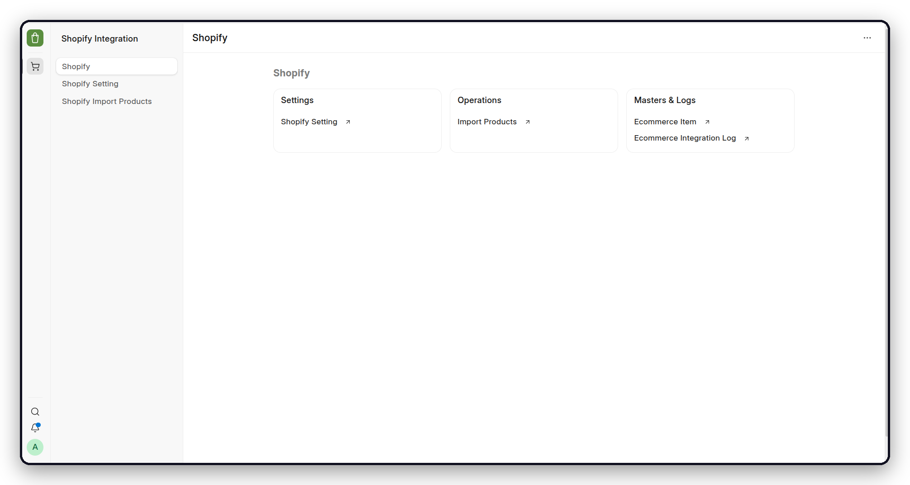
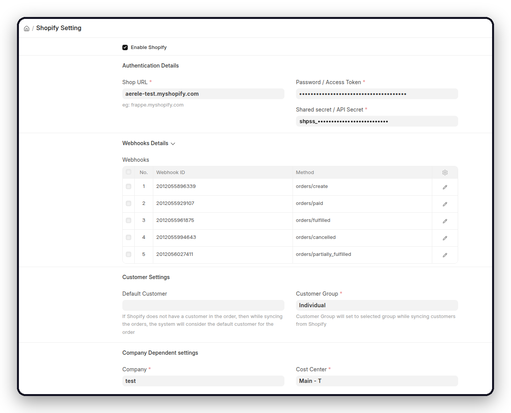
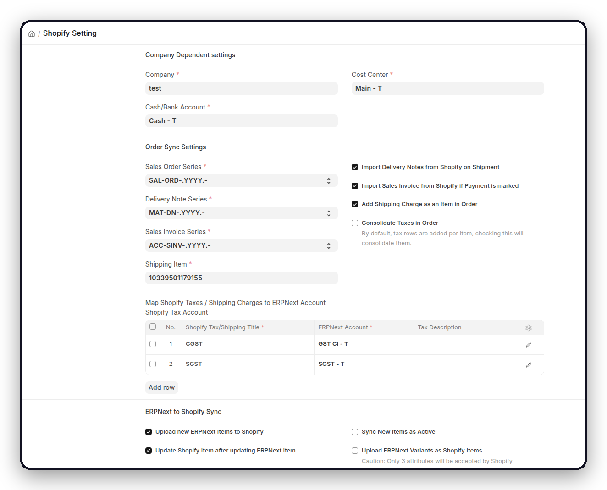

<div align="center">
    <a href="https://github.com/aerele/shopify">
	
    </a>
    <h2>Shopify Integration for ERPNext</h2>
    <div align="center">
        <p>Run your Shopify storefront on ERPNext.</p>
    </div>

[](https://github.com/aerele/shopify/actions/workflows/ci.yml)
[](https://github.com/aerele/shopify/actions/workflows/linters.yml)
[](license.txt)

</div>

<div align="center">
	
</div>

<div align="center">
	<a href="https://integrations.frappe.cloud/integrations/ecommerce-integration/shopify/overview">Documentation</a>
	-
	<a href="https://github.com/aerele/shopify/issues">Report a Bug</a>
	-
	<a href="https://github.com/aerele/shopify/pulls">Contribute</a>
</div>

## Shopify Integration

A standalone integration that connects ERPNext with Shopify.

### Motivation

A Shopify store already knows the moment an order is placed, paid, fulfilled, or
cancelled. ERPNext is where that same order has to become a Sales Order, an
invoice, a payment, and a stock movement. Without a link between them, someone
keys it in a second time.

Shopify Integration for ERPNext closes that gap as it happens. It registers
webhooks on your shop, so each event is delivered the moment Shopify records it
rather than waiting for a scheduled poll, and writes the matching document
against the company, accounts, and naming series you configure. Products and
stock move the other way, from ERPNext Items to Shopify products and from ERPNext
Warehouses to Shopify locations. Shopify identifiers are stored on every document
that is created, so an order can be followed from the storefront through to the
ledger.

### Key Features

| Workflow | Direction | What the app does |
| --- | --- | --- |
| Sales orders | Shopify → ERPNext | Creates a Sales Order on `orders/create`, with the customer, addresses, items, taxes, and shipping charges mapped to the configured accounts. |
| Sales invoices | Shopify → ERPNext | On `orders/paid`, raises a Sales Invoice against the Sales Order and a Payment Entry to the configured cash or bank account. |
| Delivery notes | Shopify → ERPNext | On `orders/fulfilled` and `orders/partially_fulfilled`, creates a Delivery Note for the fulfilled quantities. |
| Cancellations | Shopify → ERPNext | On `orders/cancelled`, records the cancellation against the linked documents. |
| Item catalogue | Two-way | Uploads new ERPNext Items to Shopify, optionally as variants, and creates Items in ERPNext for products that arrive on an order but do not yet exist. |
| Inventory | ERPNext → Shopify | Publishes ERPNext stock levels to the Shopify locations named in the warehouse mapping, at the configured frequency. |
| Historical orders | Shopify → ERPNext | Imports past orders for a chosen date range so an existing store can be brought onto ERPNext. |

Webhook payloads are queued as background jobs. Every request, failure, and retry
is recorded in Ecommerce Integration Log.

<details open>

<summary>More</summary>
	
	
</details>

### Under the Hood

- [**Frappe Framework**](https://github.com/frappe/frappe): A full-stack web application framework written in Python and JavaScript, providing the database layer, background job queue, and REST API this integration runs on.

- [**ERPNext**](https://github.com/frappe/erpnext): The accounting, stock, and selling modules that Shopify orders, invoices, and shipments are written into.

- [**Ecommerce Core**](https://github.com/aerele/ecommerce-core): The shared item mapping, integration log, and inventory utilities used across Aerele's ecommerce integrations.

- [**ShopifyAPI**](https://github.com/Shopify/shopify_python_api): The official Python client used to authenticate against a shop, register webhooks, and read products, orders, and inventory levels.

## Compatibility

| Component | Version |
| --- | --- |
| Python | 3.14 |
| Frappe Framework | v16 to v17 (`develop`) |
| ERPNext | v16 to v17 (`develop`) |
| Ecommerce Core | `develop` |
| Shopify Admin API | `2024-01` |

## Installation

From an existing bench with Frappe Framework and ERPNext:

```bash
bench get-app ecommerce_core https://github.com/aerele/ecommerce-core.git --branch develop
bench get-app shopify https://github.com/aerele/shopify.git --branch develop

bench --site <site-name> install-app ecommerce_core
bench --site <site-name> install-app shopify_integration
```

Install `ecommerce_core` first, as `shopify_integration` depends on it.

## Setup

Complete the ERPNext setup wizard and confirm that the scheduler and background
workers are running, then open **Shopify Setting** from the Shopify workspace.

**1. Connect**

Enter the Shop URL, the access token, and the shared secret, then select **Enable
Shopify** and save. Saving registers the webhooks this app listens for on your
shop, and clearing the checkbox removes them again. The registered topics are
listed in the Webhooks table.

**2. Set the company defaults**

Choose the Company, Cash or Bank Account, and Cost Center that Shopify documents
should be posted against, along with the Customer Group and the Default Customer
used when an order arrives without one.

**3. Map taxes and warehouses**

Add a **Shopify Tax Account** row for each Shopify tax or shipping title, mapping
it to an ERPNext account, and set the Default Sales Tax Account and Default
Shipping Charges Account for anything unmapped. Use **Fetch Shopify Locations**
to populate **Shopify Warehouse Mapping**, then pair each Shopify location with
an ERPNext Warehouse.

**4. Enable the workflows you need**

| To do this | Enable |
| --- | --- |
| Raise invoices on payment | **Import Sales Invoice from Shopify if Payment is marked**, with a Sales Invoice Series |
| Create Delivery Notes | **Import Delivery Notes from Shopify on Shipment**, with a Delivery Note Series |
| Publish items to Shopify | **Upload new ERPNext Items to Shopify**, plus **Update Shopify Item after updating ERPNext item** and **Upload ERPNext Variants as Shopify Items** as needed |
| Publish stock levels | **Update ERPNext stock levels to Shopify**, an Inventory Sync Frequency, and a completed warehouse mapping |
| Bill shipping as a line item | **Add Shipping Charge as an Item in Order** and a Shipping Item |
| Group tax rows | **Consolidate Taxes in Order** |
| Import past orders | **Sync Old Orders** with a From and To date |

Credential creation in Shopify Admin and the full field reference are documented
in the [integration guide](https://integrations.frappe.cloud/integrations/ecommerce-integration/shopify/overview).

## Operations

- **Last Inventory Sync** in Shopify Setting confirms that stock updates are
  reaching Shopify.
- **Ecommerce Integration Log** holds the webhook payload, the failure, and the
  retry action for every event the app handles.
- A failed webhook can be replayed from its log entry once the underlying cause,
  such as a missing account or item, has been fixed.
- Inventory sync runs on every scheduler tick and honours the configured
  frequency. Old orders are picked up hourly. Both the scheduler and the
  background workers must be running.
- Do not change an ERPNext Item Code once it has been mapped to a Shopify
  product, as the link is stored against the original code.

## Development

```bash
bench --site <site-name> set-config developer_mode 1
bench --site <site-name> migrate
bench --site <site-name> run-tests --app shopify_integration
```

Run the repository checks before opening a pull request:

```bash
cd apps/shopify_integration
pre-commit install
pre-commit run --all-files
```

## Contributing

Issues and pull requests are welcome. Please keep pull requests focused, add
tests for changed behaviour, and target the `develop` branch.

- [Report a Bug or Request a Feature](https://github.com/aerele/shopify/issues)
- [Open a Pull Request](https://github.com/aerele/shopify/pulls)

## License

[MIT License](license.txt)

<br>
<br>
<div align="center">
	<a href="https://aerele.in">
		<picture>
			<source media="(prefers-color-scheme: dark)" srcset="./shopify_integration/public/images/aerele-dark.png">
			
		</picture>
	</a>
</div>
